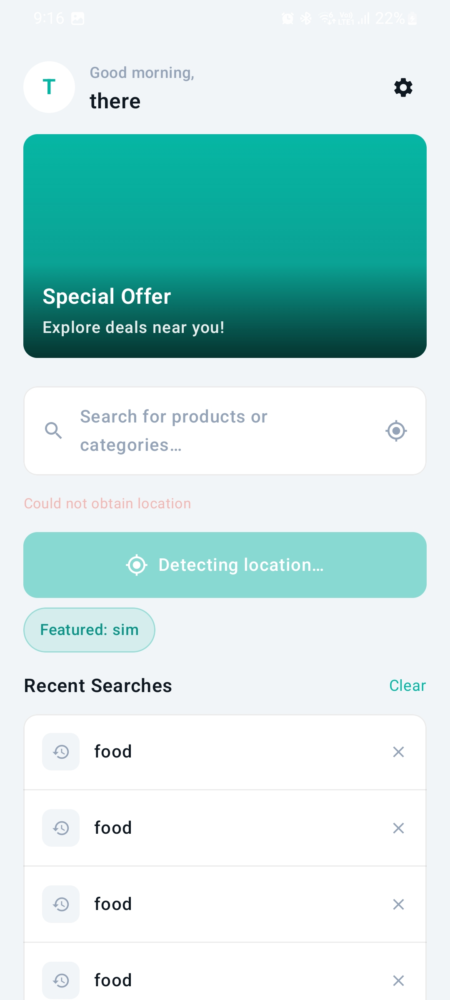

# About the Project

This is an Android app built with Jetpack Compose for the Zave assignment. 

## Tech Stack

+ Kotlin
+ Jetpack Compose
+ MVVM Architecture
+ Koin
+ Retrofit
+ Room
+ Coil
+ Firebase

## Project Structure

### data 
- dao-- data access object for room database local cache storage
- database --room database config file
- dto --data transfer object for Retrofit
- entities -- entities for room db
- remote-- retrofit config to fetch data from api
- repositories --implementation of domain layer repositories interface

### di
- dependency injection using koin for project

### domain
- models -- data models 
- repositories -- repo interfaces

### ui
- viewModels -- Viewmodels for all compose screens
- navigation -- Navigation is handled here using Compose NavGraph
- screens --Composables for all the screens

### utils
- contains util to handle state of networking

## Setup
- Integrate your Project with firebase
- Get your Google Cloud Key

## Figma 
 [Click here to See Figma Design](https://www.figma.com/design/szHOzvpwyZY4ciFCIpzir4/Untitled?node-id=27-2)

## Screenshot and Demo

|            Screen 1            |            Screen 2            |           Screen 3            |
|:------------------------------:|:------------------------------:|:-----------------------------:|
|  |  |  |

|            Screen 4            |
|:------------------------------:|
|  | 

## Demo
[To download the app click here](assets/app-debug.apk)

## Firebase Console
